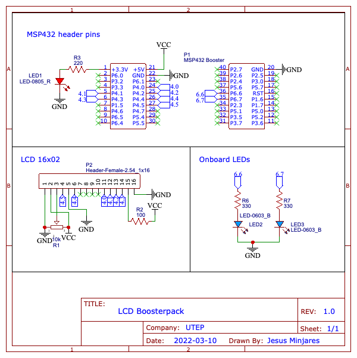

# Liquid Crystal Display (LCD) Boosterpack :zap:

The **LCD Boosterpack** is a custom `printed circuit board` *(PCB)* for the **MSP432** to ensure quick development for [LCD 16x02](https://components101.com/displays/16x2-lcd-pinout-datasheet). The boosterback will remove the redunancy of connections to use the LCD. Therefore, it will allow reusabilty by making easy to use.

## **Features**
- [x] SMD onboard LEDs
- [x] Quick deployment for LCD 16x02
- [x] Power LED 
- [x] Added pin number on top silkscreen 

## Electronic Design Automation
The board was developed in [*EasyEDA*](https://easyeda.com/). 

![EasyEDA](https://img.shields.io/static/v1?label=&message=EasyEDA&color=5588FF&logo=data:image/png;base64,iVBORw0KGgoAAAANSUhEUgAAAGUAAABlCAYAAABUfC3PAAAAAXNSR0IArs4c6QAACJNJREFUeF7tnXlsF0UUx78th60iQoIQlSMmJh54RkKiiMFgjNFoIodQQChEDEEgBQGj4RASFSlHBZWjQKQCrQfRSMSLEDQQjRLBC1ACGkEBD1AwhdIi5tFOftPt7s6b3dnfb7bM%2Ftff782b976febP7252d5g2cc%2FYs3GGVAnkOilU8zgXjoNjHxEGxkImD4qDYqICFMblzioNioQIWhuQqxUGxUAELQ3KV4qBYqICFIblKcVAsVMDCkFylOCgWKmBhSKmvlJfHAB3a8pTd9DVQ%2FiHPNpdWqYTy%2BtT4klXXACNfjO8nCQ%2BpgmIChp%2BIg%2BYmIW10n6mAkhQMWbZj%2FwJjXokupMmWVkNp2QJY%2B4TJdNW%2BbKgaa6HMLQa6dVSLmIRFrsFYCaViInBBK77cNXXA8AXB9h3bAYsf4%2Fsjy1yCsQ5K2WjgsvY8AaMId1EBsGpCcv55nsOtsg6ldUvgtUnxQo8Cw9sjgacBoDpM9KXqw%2Ft9VqDk5wGVU3RDa2pPywYHl8b3I3vgXNllG0ziUDhJc2TesR%2BY8xbHUt9GFePTFcC%2Bw%2Fp%2Bo7ZIDIoqUZ2As%2FHrWxVvNqslESiqBHWAZPNKKCzuF9YDX%2B3TjTyavXEoaQVC8j1TBFzbJVzICcuBI39HE5vbyigUHSCTVwEH%2Fmwa5uyhwNVXZD7P5rRBvXJzGP0ScLyaK7OenTEonGRO1QIjFuoFmG1rTh5yTEkMmqxBSSL4pIDlGowRKKok0gREZwpLqmISh5I2ICR07%2B4A%2FeB9sCfQuQO%2FHk3lGhtKWJWc%2BQ8YMo%2BflM2Wg3sDD90WHuHG7cDqzfGzSBSKqZETP01zHrIxVTsoEXiFgTGxOCMxKFu%2BA5ZsjJBxCpq0KQRWjg8ONO4MkRiUofOBujN2Klw1BVj7CbDhi%2BjxhVWLtVDiBhZdruCWXiHjxJhKKDPWAT8cTEJafZ9JCHh9N2D6IP9Y4sAmj4lNX%2BQ8bnD68jduobpSIusRZcCp0%2Fo9tW8DLB17HkBRibjzJ%2BD5N9UCqvx4PUQZPA%2F0BIb1SSGU4jLgJGMU6oq45yAwc11TQXT9CA%2FDFwI1tWrYskUSU6LwH3v6Ui2EUI3CqEKK6bFFPrBusp6gwloVW5hXq6FQ4Cphg5JXtYsmtbpVHBjkvWoqkBfSTVz%2FsSuFYrvrRmDMveFieAPNBZC4YlGGbQuB8gR%2FOBq5%2BhIoOCKLcwzHVj3e%2BRYmYFBvnMfFJvoyUik6YDhSehMraAWsnshpmbGhneUGG3rF4c7uwOP3q%2Fs3AcRopZxzlgfQLYw4R1hinArTeeQ8bxTQReN5SVhe720HKgzctjcOhRwmeTUUBmX%2FYeCpCv5w4ADmezP7Q9no9CUnESVpVfkP7AUM6OUvlaqtt1WU%2BPx6%2FusEMHaJDj61bWJQqGvdxFXCrhgPXFxoDxR6qkpPV00fiULRvQDYdQCYVRmcoskfbLoDRo4q6WW0WYEiEurUDlikeHmHpgKaEnSnG1WV%2BaHWBTNsAVBbZ7oumvrLKhSdytm2G9i6C3iyv1qEYfOBWksfqKmjtwRKlPNNWHJRqiSKWNlqk5NKoeQWjgYuZ75Gdz4BoVxzBoU6p7e7aNFb1KO5VYjQIadQKIgbugHTAh6rnm8VYg0UEQjdnqHbNKqDdoWg3SGa85HzSvETt7gv0PcmgB6g%2FVMNjF%2Bm%2F2QwzdCshJJmQU3E7qCYUNGwDwfFsKAm3DkoJlQ07MNBMSyoCXcOigkVDfuIDEV1h7WkHDh0zHC0mu6WjwMuuTC8kXxXICgn7p0D0X7J%2B8CWbzWDlcwTg0J9cJOJHn54S9XAkWOc2g%2B49apgf5u%2FAZZ9EPw97cxEv6vEESf32FB%2BPgLUep6%2BVZ8CnmOs%2BU0KhvArQ6E45YNifvYN4GRN%2Faey7e4DwJWdgILWjduELcM1%2BZpFJCjXdAZmDakPWGdE3H0zsGknD8U9twAf7eDZBlnJQqniDLNV%2BfF7TK3qLyyzSFBWl2RGEadzv2lEZymrsBV%2BSlYAh442TstPOPHZ3t%2BAaWv4U503NtrLkva0DBqEOvlxhlkkKKqRI3ccNq%2FTOilaL%2BU33cg%2BxKt6nNFMq%2FFpVb48JY1bCvxxPDoU7%2FQmQ1s5AWhTkJkx%2BvcC1m%2FjSB9sExtKkGsKPEjEyslAfn6mpbcSxIgUW%2BCK7%2BXFfkFXTZyrKdGzny3tvOf3j3uDcqHPhR%2FajFT3lQo%2F%2FRKBcvQEsHV3%2FY4NnJIPguIXsBBHFk98Jr%2BVVdgaeLUkfMT6QeFMq8JG7ApLf6%2BZBLRqmQEkw9Ktm1hQKj8F3vncv0vVFBc28oTH6WuBH38NP3dw%2FKjOe%2FIelzpQRN%2FeNkGfc%2BHEghKWLBfK978As6uChafvyEYc%2FW8HHr6j%2Fi9aDCdeGAoSJqhS5R6n9AN6NPxGUUF5dDFw4mSmMrxTYekooGvD%2BmTaz4z2NdM9cg5FJYKfqJyrHdWgkIVS2YZd2akEV1WpkXMK9zdKWKIzi4DrGrYF9M7rnHme80NNJTQXiuznzFlgSGl9ddJCdjp%2B99m6kM4t9PYwp0qNQAm7xKUOTtcBjzRscS7binthQYLKn9NuQPf1yITrHW3ee1p%2Bo1EVp85VmneK4gCPc17Rnr5Uycqjg%2F6jA13Whh1%2BV16yvd%2F7JvJ5hTP9%2BfUvr5bXyUl%2B35FzTi17F%2Fhsj2qSa%2Fy9cSi03HTRhkwnQ%2FtkLo3p05UfZ26feC8bu14KlI7MtKX7UsU%2B%2Fw1IZ6QGycGplC%2F3AvPebuyB0ze14NoZmb70mJu3nlEEdPc5H5nvKXcetSsld6HW9yxGIO2QRLdfmuORKijl44C2DQ%2BtolxqpgVgqqCIKqFb%2BnRuaq5HqqA0VwjevBwUC0k7KA6KhQpYGJKrFAfFQgUsDMlVioNioQIWhuQqxUGxUAELQ3KV4qBYqICFIblKsRDK%2F0ANm%2Fr7waacAAAAAElFTkSuQmCC)

## **Schematic**

## **3D View**

## **Authors:**
* [**Jesus Minjares** :zap:](https://github.com/jminjares4) 
  * Master of Science in Computer Engineering 
 
 
* [**Jorge Minjares** :zap:](https://github.com/JorgeMinjares) 
  * Bachelor of Science in Electrical Engineering 
 
 

